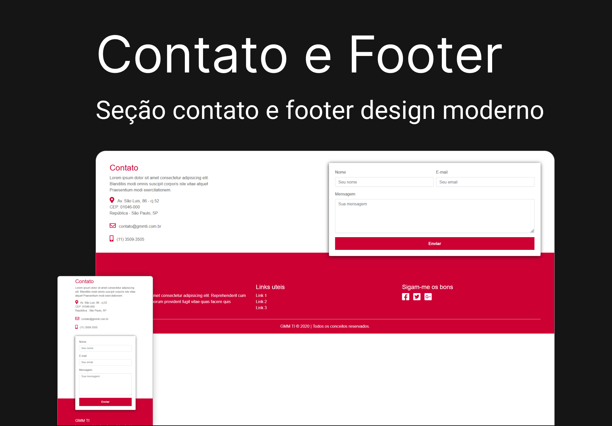

<div align="center">

  # Contato e Footer
  
  <p>Seção de contato e footer com design moderno e clean. <br />
  Formulário com acessibilidade e campos requiridos</p>

   &nbsp;
   &nbsp;
   &nbsp;
   &nbsp;
   &nbsp;

  
</div>

<div>

  # ⚡ Overview
  <b>Contato e Footer</b>: Seção de informações e formulários para contato.<br />
  Layout clean e moderno.
   
  ## Features:
  - Manipulação de DOM
  - Totalmente Responsivo
  - SEO otimizado
  - W3C validação
  - Página com carregamento rápido
  - Layout Clean e Moderno

  # 📚 Aprendizados
  Extrair a paleta de cores da brand da empresa e utiliza no projeto. <br />
  Trabalhar com Bootstrap 5 e responsividade.
  <br /><br />
  
  # 🚀 Deploy
  [Ver online](https://cdpn.io/SoftwaRealles/fullpage/MWKVVmp)

  ## Clone

  ```
  git clone git@github.com:DiogoRealles/contact-footer.git
  ```
</div>


<footer>
  <p>Gostou? deixa seu like!</p>
  <p>Estou disponível para realizar seus projetos</p>
  <a href="mailto:diogorealles@hotmail.com"></a>
  <a href="https://www.linkedin.com/in/diogorealles/"></a>
  
  <p><strong>Diogo Realles | 2024</strong></p>
</footer>
